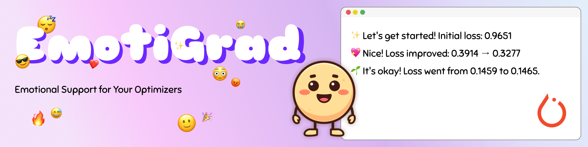

# 🌈 EmotiGrad — Emotional Support for Your Optimizers

<p align="center">
  
</p>

<p align="center">
  
  
  
  
  
</p>


EmotiGrad is a tiny Python library that wraps your PyTorch optimizers and gives you emotionally-charged feedback during training, from wholesome encouragement to unhinged sass.

It aims to be:

* **Drop-in friendly**: swap it into any `torch.optim` workflow
* **Fun but useful**: emotional logs + basic training insights
* **Extensible**: easily add new "personalities" and behaviors

## Features

- Drop-in PyTorch optimizer wrapper
- Emotional personalities with trend detection
- `message_every=N` smoothing via averaged loss blocks
- Extensible personality system (functions or classes)
- Built-in registry for named personalities

## Why EmotiGrad?

Training deep learning models can be repetitive and opaque.  
EmotiGrad adds a layer of emotional, trend-aware feedback that makes training:

- more fun  
- more human  
- easier to interpret  
- easier to debug (loss trends are highlighted automatically)


## Status

> ⚠️ EmotiGrad is under active early development (pre-release).
> Expect the API to evolve before version `0.1.0`.
> Feedback and ideas are *very* welcome!

## Installation

📦 **PyPI Details:** https://pypi.org/project/emotigrad/

EmotiGrad is available on PyPI for easy `pip` installation using the command below. 

```bash
pip install emotigrad
```

For development:

```bash
git clone git@github.com:smiley-maker/emotigrad.git
cd emotigrad
pip install -e ".[dev]"
```

### Requirements

- Python 3.10+
- PyTorch (installed automatically on most systems, but GPU users may want a custom install)


## Quick Start

Here’s the smallest possible example:

```python
import torch
from emotigrad import EmotionalOptimizer

model = torch.nn.Linear(10, 1)
base_opt = torch.optim.Adam(model.parameters(), lr=1e-3)

# Wrap your optimizer with a personality
opt = EmotionalOptimizer(
    base_opt,
    personality="wholesome",   # also: "sassy", "quiet", custom callables, etc.
    message_every=20,           # feedback every 20 steps (averaged)
)

for step in range(50):
    x = torch.randn(32, 10)
    y = torch.randn(32, 1)

    preds = model(x)
    loss = (preds - y).pow(2).mean()

    opt.zero_grad()
    loss.backward()

    # Provide loss to trigger feedback
    opt.step(loss=loss.item())
```

### How `message_every` works

Instead of reacting to every single (noisy) loss value, EmotiGrad:

1. Collects the last **N** loss values
2. Computes the **average loss for that block**
3. Compares it to the **previous block’s average**
4. Feeds the result into your chosen personality

This produces smoother, more meaningful emotional feedback.

Set `message_every=1` for per-step chatter.


## Example Output

Running the MNIST example (in `examples/mnist_training.py`) produces friendly, trend-aware messages like:

```bash
[Epoch 1] step=0, loss=2.3374
✨ Let's get started! Initial average loss: 0.9651

[Epoch 1] step=200, loss=0.2371
💖 Nice! Loss improved from 0.3914 → 0.3277.
💖 Nice! Loss improved from 0.3277 → 0.2768.

[Epoch 1] step=600, loss=0.1402
💖 Nice! Loss improved from 0.2588 → 0.2239.
💖 Nice! Loss improved from 0.2239 → 0.2199.

[Epoch 2] step=200, loss=0.1256
🌱 It's okay! Loss went from 0.1459 → 0.1465. Learning isn't always monotonic.
💖 Nice! Loss improved from 0.1702 → 0.1489.
```

Your model learns and your optimizer cheers you on.

## Personalities

EmotiGrad ships with several built-in personalities, such as:

* **wholesome** – kind, encouraging, proud of your progress
* **sassy** – mildly offended by your gradients
* **quiet** – reports occasionally, like a stoic mentor

You can also write your own:

```python
def hype(loss, prev, step):
    if prev and loss < prev:
        return f"🚀 Step {step}: HUGE gains! {prev:.4f} → {loss:.4f}"
    return None

opt = EmotionalOptimizer(base_opt, personality=hype)
```

Or register them globally:

```python
from emotigrad.personalities import register_personality

register_personality("hype", hype)
opt = EmotionalOptimizer(base_opt, personality="hype")
```

## Examples

You can find examples in the `examples/` directory:

* `basic_usage.py`: minimal working example
* `mnist_training.py`: full training loop with emotional feedback
* `custom_personality.py`: how to define your own personality

## Roadmap

Planned features:

* More built-in emotional personas:
  * `wholesome`, `sassy`, `quiet`, `chaotic`, `roaster`, `nervous`, etc.
* Trend-aware training feedback
* Configurable output formatting (e.g. text colors and formatting)
* Easy hooks for custom personalities
* Optional LLM-based “training advisor” mode
* Integrations with:
  * PyTorch Lightning
  * HuggingFace Trainer
* Rich visual outputs (ASCII art, emoji graphs, etc.)

## Contributing

Contributions are warmly welcome — even small improvements help!

Ways to contribute:

* Report bugs or confusing APIs
* Suggest new personalities or features
* Improve tests or documentation
* Add examples

To set up development:

```bash
git clone git@github.com:smiley-maker/emotigrad.git
cd emotigrad
pip install -e ".[dev]"
pytest
```

We also recommend using a virtual environment or conda during local development.

### Running Tests

Run tests using:

```bash
pytest
```

Note that when using a virtual environment you made need to run with:

```bash
python -m pytest
```


## Project Structure

```
emotigrad/
  src/
    emotigrad/
      __init__.py
      base.py           # EmotionalOptimizer
      personalities.py  # built-in personas + registry
      types.py          # Personality Protocol
  tests/
  examples/
  README.md
  LICENSE
  pyproject.toml
```

## Changelog

### 0.0.1: First Release 🎉
- `EmotionalOptimizer` class with averaged-loss trend detection
- Built-in personalities (wholesome, sassy, quiet) with more on the way. 
- Personality registry and option to create your own personalities. 
- Examples with initial documentation.


## License

EmotiGrad is released under the MIT License.
See the LICENSE file for details.


## Thanks for checking out EmotiGrad

If you build something with it, please share it or open an issue, I’d love to see what you make! If you enjoy EmotiGrad, consider  starring the repo, it helps others discover it! ⭐️

